# 详细设计-流程图与类图

## 1. 文档说明

本文档在《详细设计.md》的基础上，将系统设计逐个落实为流程图和类图。图示使用 Mermaid 语法，可在支持 Mermaid 的 Markdown 工具中直接渲染。

覆盖范围：

- 系统总体结构。
- 后端核心模块。
- 数据库实体关系和本地文件存储关系。
- Vue 3 网页端。
- Windows Electron 客户端。
- Android Kotlin 客户端。

## 2. 系统总体图

### 2.1 总体部署与调用流程图

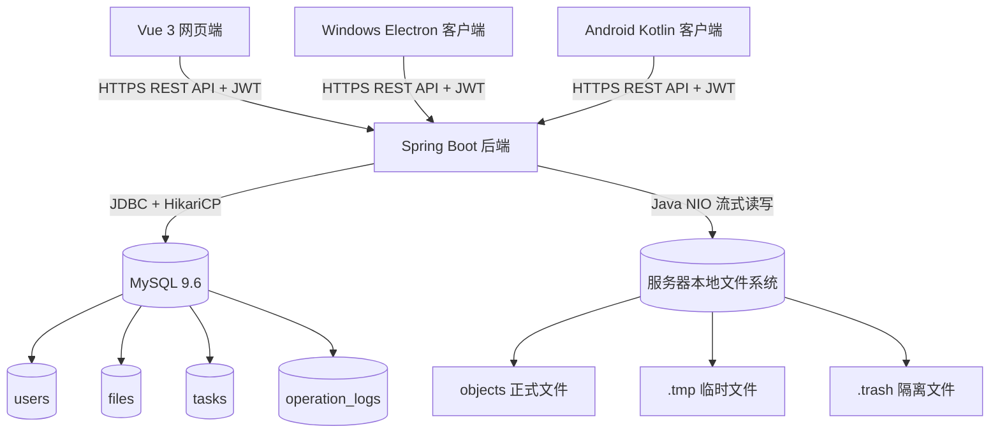

### 2.2 后端分层类图

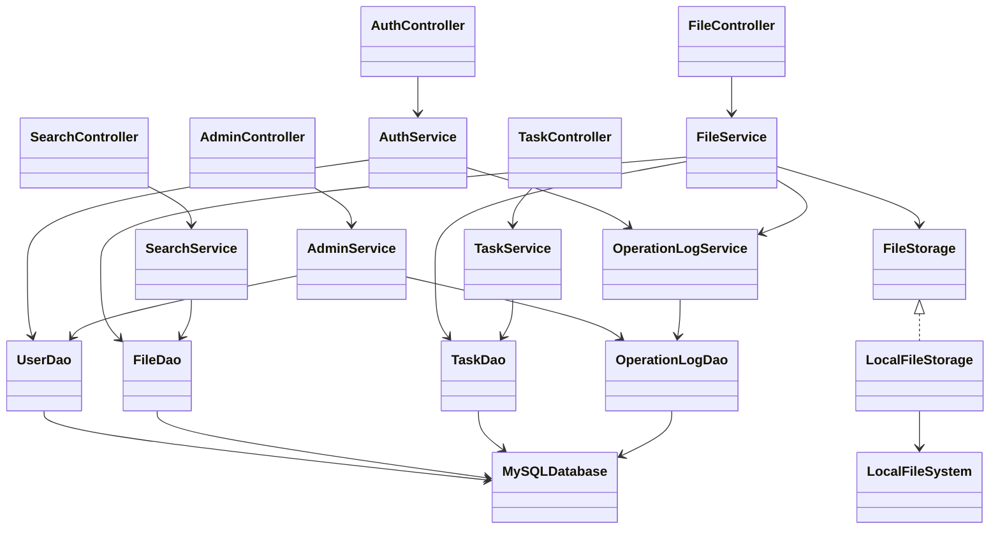

## 3. 用户认证模块

### 3.1 注册流程图

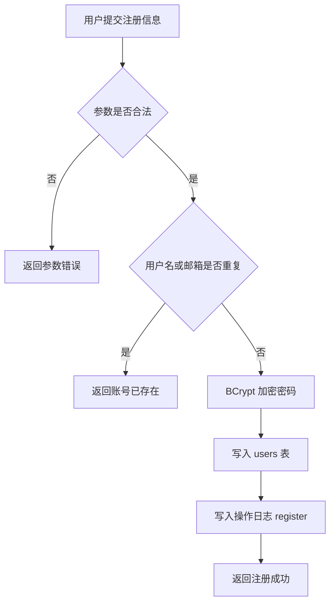

### 3.2 登录流程图

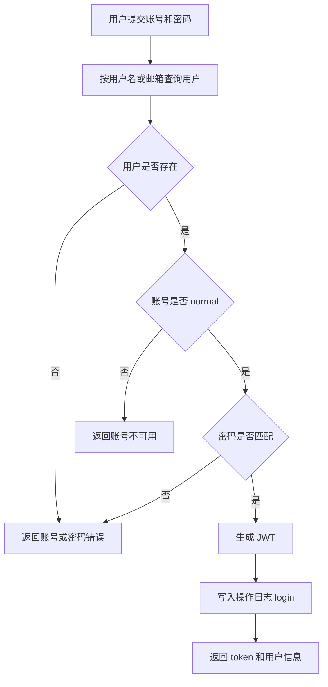

### 3.3 认证模块类图

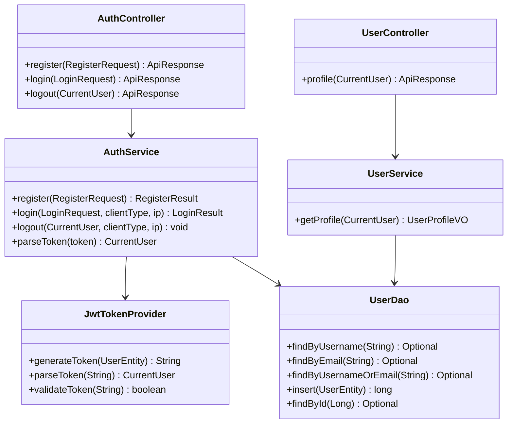

## 4. 文件管理模块

### 4.1 文件列表流程图

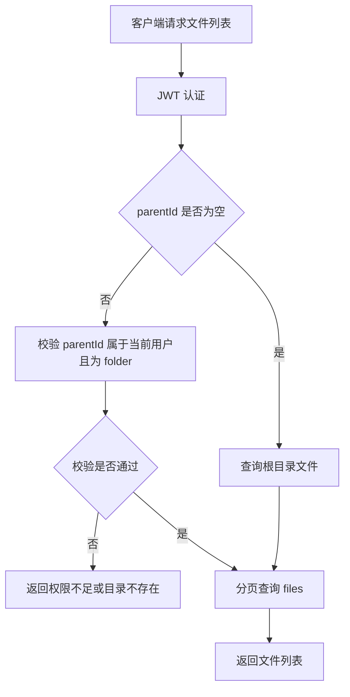

### 4.2 文件上传流程图

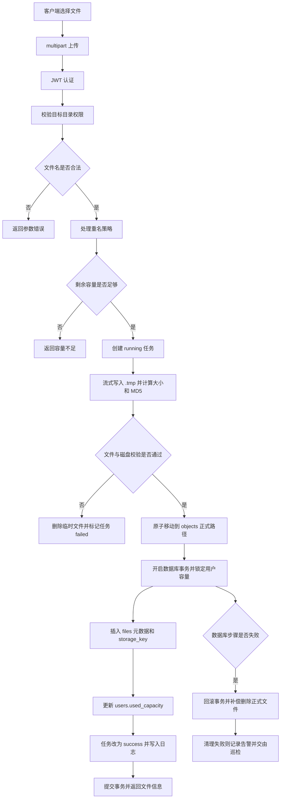

### 4.3 文件下载流程图

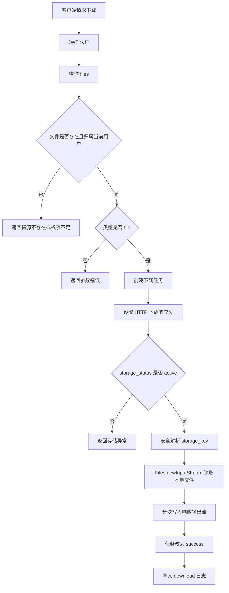

### 4.4 新建文件夹流程图

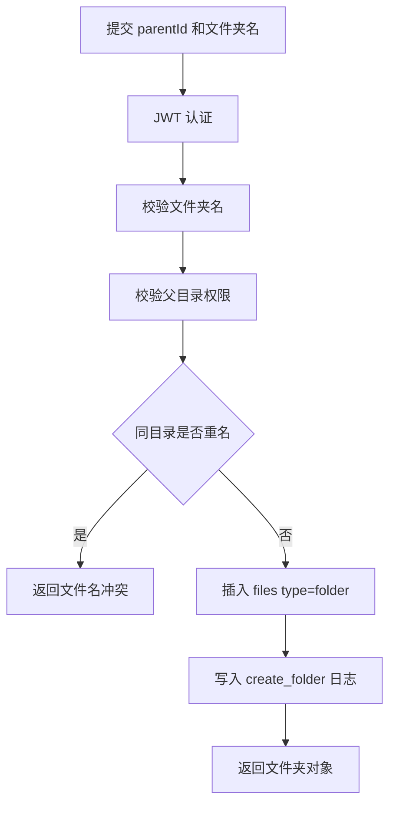

### 4.5 重命名流程图

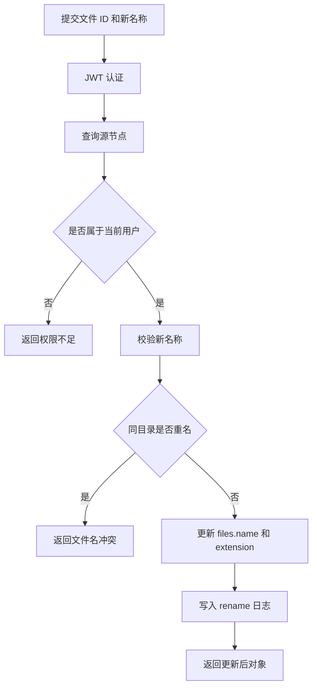

### 4.6 移动流程图

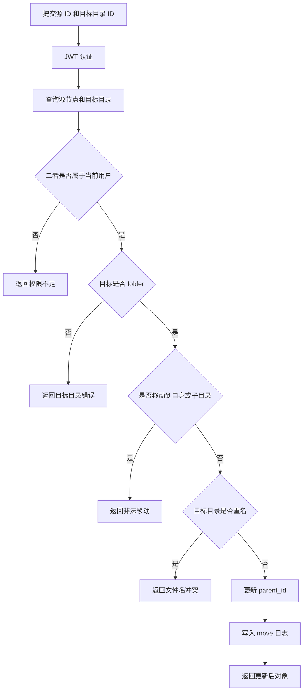

### 4.7 删除流程图

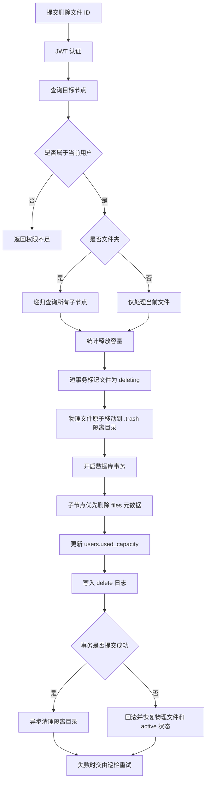

### 4.8 文件模块类图

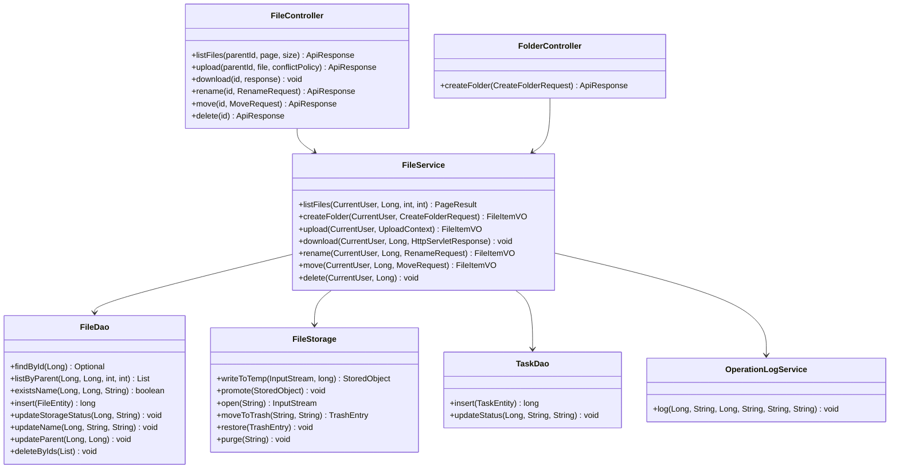

## 5. 搜索模块

### 5.1 搜索流程图

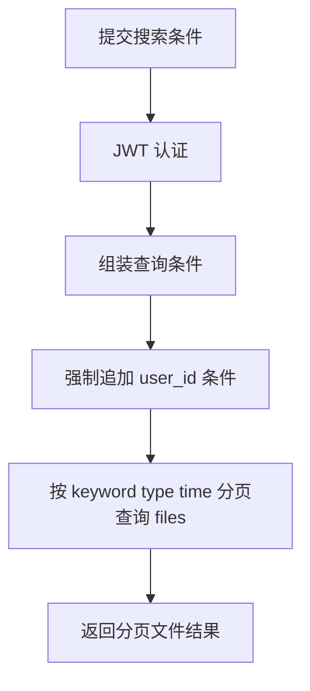

### 5.2 搜索模块类图

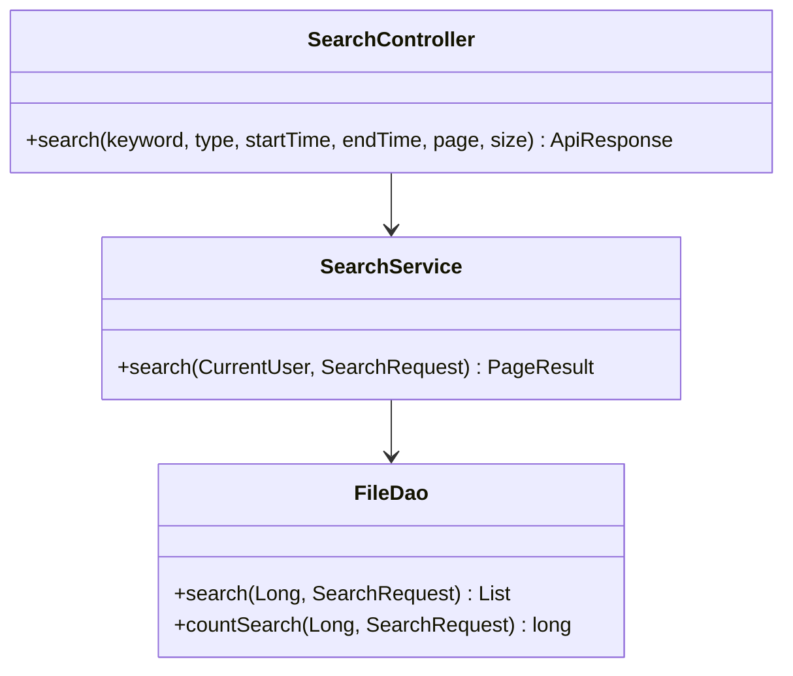

## 6. 容量模块

### 6.1 上传容量校验流程图

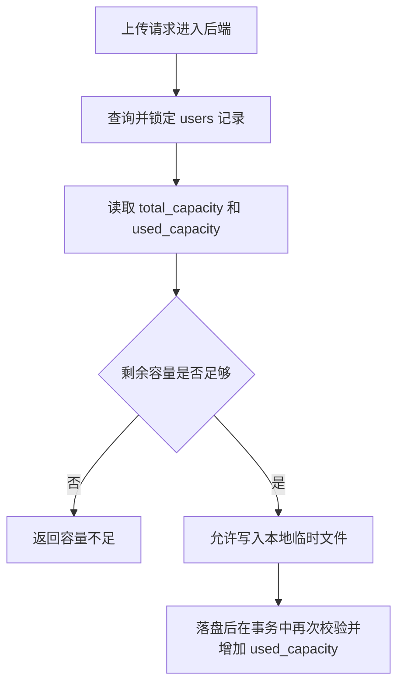

### 6.2 删除释放容量流程图

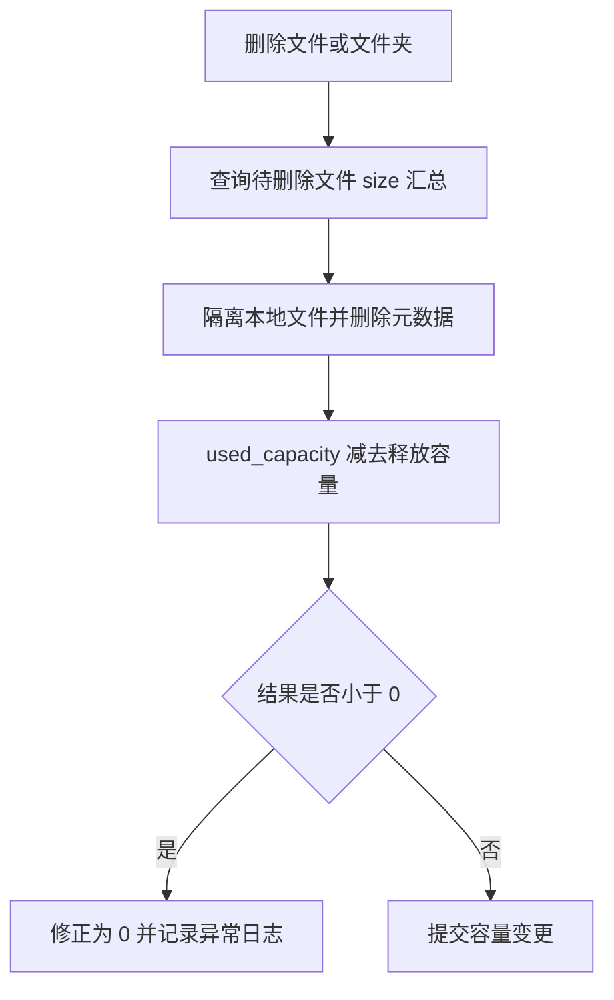

### 6.3 容量相关类图

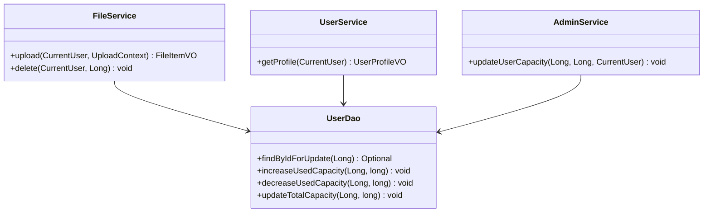

## 7. 任务模块

### 7.1 上传任务状态流程图

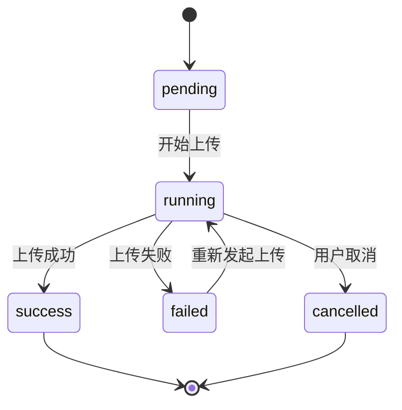

### 7.2 下载任务状态流程图

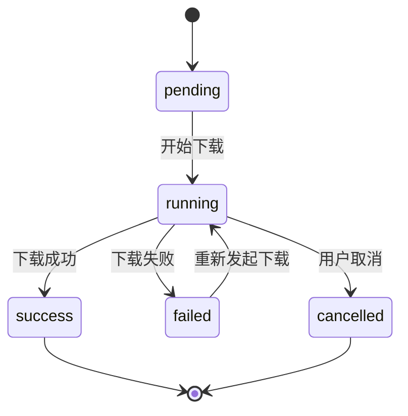

### 7.3 任务模块类图

```mermaid
classDiagram
    class TaskController {
        +listTasks(status, page, size) ApiResponse
        +getTask(id) ApiResponse
        +cancel(id) ApiResponse
        +retry(id) ApiResponse
    }

    class TaskService {
        +listTasks(CurrentUser, String, int, int) PageResult
        +getTask(CurrentUser, Long) TaskVO
        +cancel(CurrentUser, Long) void
        +retry(CurrentUser, Long) void
    }

    class TaskDao {
        +insert(TaskEntity) long
        +findById(Long) Optional
        +listByUser(Long, String, int, int) List
        +updateStatus(Long, String, String) void
        +updateProgress(Long, int) void
    }

    TaskController --> TaskService
    TaskService --> TaskDao
```

## 8. 管理员模块

### 8.1 管理员访问控制流程图

```mermaid
flowchart TD
    A[请求管理员接口] --> B[JWT 认证]
    B --> C{role 是否 admin}
    C -->|否| D[返回权限不足]
    C -->|是| E[进入管理员业务逻辑]
    E --> F[写入管理员操作日志]
    F --> G[返回处理结果]
```

### 8.2 调整用户容量流程图

```mermaid
flowchart TD
    A[管理员提交用户 ID 和新容量] --> B[校验管理员角色]
    B --> C[查询目标用户]
    C --> D{用户是否存在}
    D -->|否| E1[返回资源不存在]
    D -->|是| F{新容量是否小于已用容量}
    F -->|是| E2[返回容量参数错误]
    F -->|否| G[更新 total_capacity]
    G --> H[写入 admin_update_capacity 日志]
    H --> I[返回成功]
```

### 8.3 管理员模块类图

```mermaid
classDiagram
    class AdminController {
        +listUsers(keyword, page, size) ApiResponse
        +getUser(id) ApiResponse
        +updateStatus(id, request) ApiResponse
        +updateCapacity(id, request) ApiResponse
        +storage() ApiResponse
        +logs(query) ApiResponse
    }

    class AdminService {
        +listUsers(AdminQueryRequest) PageResult
        +getUser(Long) UserAdminVO
        +updateUserStatus(Long, String, CurrentUser) void
        +updateUserCapacity(Long, Long, CurrentUser) void
        +getStorageStat() StorageStatVO
        +listLogs(LogQueryRequest) PageResult
    }

    class UserDao {
        +listUsers(AdminQueryRequest) List
        +findById(Long) Optional
        +updateStatus(Long, String) void
        +updateTotalCapacity(Long, long) void
    }

    class OperationLogDao {
        +listLogs(LogQueryRequest) List
        +insert(OperationLogEntity) long
    }

    AdminController --> AdminService
    AdminService --> UserDao
    AdminService --> OperationLogDao
```

## 9. 操作日志模块

### 9.1 日志写入流程图

```mermaid
flowchart TD
    A[业务操作成功] --> B[组装日志字段]
    B --> C[写入 operation_logs]
    C --> D{写入是否成功}
    D -->|是| E[继续返回业务结果]
    D -->|否| F[记录服务端错误日志]
    F --> E
```

### 9.2 日志模块类图

```mermaid
classDiagram
    class OperationLogService {
        +log(Long, String, Long, String, String, String) void
        +listLogs(LogQueryRequest) PageResult
    }

    class OperationLogDao {
        +insert(OperationLogEntity) long
        +listLogs(LogQueryRequest) List
        +countLogs(LogQueryRequest) long
    }

    class OperationLogEntity {
        +Long id
        +Long userId
        +String action
        +Long targetId
        +String targetType
        +String clientType
        +String ipAddress
        +LocalDateTime createdAt
    }

    OperationLogService --> OperationLogDao
    OperationLogDao --> OperationLogEntity
```

## 10. 数据库实体与本地存储类图

```mermaid
classDiagram
    class UserEntity {
        +Long id
        +String username
        +String email
        +String passwordHash
        +String role
        +Long totalCapacity
        +Long usedCapacity
        +String status
        +LocalDateTime createdAt
        +LocalDateTime updatedAt
    }

    class FileEntity {
        +Long id
        +Long userId
        +Long parentId
        +String name
        +String type
        +String mimeType
        +Long size
        +String storageKey
        +String storageStatus
        +String md5
        +String extension
        +LocalDateTime createdAt
        +LocalDateTime updatedAt
    }

    class LocalStoredObject {
        +String storageKey
        +Path physicalPath
        +Long size
        +String md5
    }

    class TaskEntity {
        +Long id
        +Long userId
        +Long fileId
        +String taskType
        +String clientType
        +String status
        +Integer progress
        +String errorMessage
        +LocalDateTime createdAt
        +LocalDateTime updatedAt
    }

    class OperationLogEntity {
        +Long id
        +Long userId
        +String action
        +Long targetId
        +String targetType
        +String clientType
        +String ipAddress
        +LocalDateTime createdAt
    }

    UserEntity "1" --> "*" FileEntity
    FileEntity "1" --> "0..1" LocalStoredObject : storageKey 映射
    UserEntity "1" --> "*" TaskEntity
    FileEntity "0..1" --> "*" TaskEntity
    UserEntity "1" --> "*" OperationLogEntity
    FileEntity "0..1" --> "*" FileEntity : parent-child
```

## 11. Vue 3 网页端

### 11.1 网页端页面流程图

```mermaid
flowchart TD
    A[打开网页端] --> B{本地是否有 token}
    B -->|否| C[登录页]
    B -->|是| D[请求用户信息]
    D --> E{token 是否有效}
    E -->|否| C
    E -->|是| F[网盘首页]
    C --> G[登录成功]
    G --> F
    F --> H[文件列表]
    F --> I[上传文件]
    F --> J[下载文件]
    F --> K[新建文件夹]
    F --> L[搜索]
    F --> M[用户信息]
    F --> N{是否管理员}
    N -->|是| O[管理员页面]
```

### 11.2 Vue 3 前端类图

```mermaid
classDiagram
    class HttpClient {
        +get(url, params)
        +post(url, body)
        +patch(url, body)
        +delete(url)
        +download(url)
    }

    class AuthStore {
        +String token
        +User user
        +login()
        +logout()
        +loadProfile()
    }

    class FileStore {
        +Long currentParentId
        +FileItem[] files
        +loadFiles()
        +uploadFile()
        +downloadFile()
        +renameFile()
        +moveFile()
        +deleteFile()
    }

    class TaskStore {
        +Task[] tasks
        +loadTasks()
        +updateLocalProgress()
    }

    class DriveView
    class FileTable
    class UploadDialog
    class TaskDrawer

    AuthStore --> HttpClient
    FileStore --> HttpClient
    TaskStore --> HttpClient
    DriveView --> FileStore
    DriveView --> AuthStore
    DriveView --> FileTable
    DriveView --> UploadDialog
    DriveView --> TaskDrawer
```

## 12. Windows Electron 客户端

### 12.1 Windows 客户端流程图

```mermaid
flowchart TD
    A[启动 Electron 应用] --> B[主进程创建窗口]
    B --> C{安全存储是否有 token}
    C -->|否| D[显示登录窗口]
    C -->|是| E[验证 token]
    E --> F{是否有效}
    F -->|否| D
    F -->|是| G[显示主窗口]
    G --> H[渲染远程文件列表]
    G --> I[调用系统文件选择上传]
    G --> J[调用系统目录选择下载]
    G --> K[打开任务窗口]
```

### 12.2 Electron 客户端类图

```mermaid
classDiagram
    class MainProcess {
        +createLoginWindow()
        +createMainWindow()
        +registerIpcHandlers()
    }

    class PreloadApi {
        +selectFiles()
        +selectDirectory()
        +saveToken()
        +getToken()
        +clearToken()
    }

    class TokenStore {
        +save(token)
        +get()
        +clear()
    }

    class RendererApp {
        +mount()
        +route()
    }

    class WindowsFileService {
        +selectLocalFiles()
        +selectDownloadDirectory()
        +writeDownloadFile()
    }

    class ApiClient {
        +request()
        +upload()
        +download()
    }

    MainProcess --> PreloadApi
    PreloadApi --> TokenStore
    PreloadApi --> WindowsFileService
    RendererApp --> PreloadApi
    RendererApp --> ApiClient
```

## 13. Android Kotlin 客户端

### 13.1 Android 页面流程图

```mermaid
flowchart TD
    A[启动 Android 应用] --> B{DataStore 是否有 token}
    B -->|否| C[LoginActivity]
    B -->|是| D[请求用户信息]
    D --> E{token 是否有效}
    E -->|否| C
    E -->|是| F[MainActivity]
    F --> G[FileListFragment]
    F --> H[TaskFragment]
    F --> I[ProfileFragment]
    G --> J[系统文件选择器上传]
    G --> K[下载到设备目录]
    G --> L[长按文件操作菜单]
```

### 13.2 Android 客户端类图

```mermaid
classDiagram
    class LoginActivity
    class MainActivity
    class FileListFragment
    class TaskFragment
    class ProfileFragment

    class AuthViewModel {
        +login()
        +logout()
        +loadProfile()
    }

    class FileViewModel {
        +loadFiles()
        +upload()
        +download()
        +rename()
        +move()
        +delete()
        +search()
    }

    class TaskViewModel {
        +loadTasks()
        +cancelTask()
        +retryTask()
        +updateProgress()
    }

    class ApiService {
        +login()
        +getFiles()
        +uploadFile()
        +downloadFile()
    }

    class TokenStore {
        +saveToken()
        +getToken()
        +clearToken()
    }

    class FileRepository
    class AuthRepository
    class TaskRepository

    LoginActivity --> AuthViewModel
    MainActivity --> FileListFragment
    MainActivity --> TaskFragment
    MainActivity --> ProfileFragment
    FileListFragment --> FileViewModel
    TaskFragment --> TaskViewModel
    ProfileFragment --> AuthViewModel
    AuthViewModel --> AuthRepository
    FileViewModel --> FileRepository
    TaskViewModel --> TaskRepository
    AuthRepository --> ApiService
    FileRepository --> ApiService
    TaskRepository --> ApiService
    AuthRepository --> TokenStore
```

## 14. 三端一致性流程图

```mermaid
flowchart TD
    A[任一客户端完成文件操作] --> B[后端协调本地文件系统和数据库事务]
    B --> C[协调成功后返回操作成功]
    C --> D[当前客户端刷新当前目录]
    C --> E[当前客户端刷新容量信息]
    F[其他客户端用户手动刷新或重新进入目录] --> G[请求同一后端文件列表接口]
    G --> H[读取 MySQL 最新文件元数据]
    H --> I[展示一致文件状态]
```

## 15. 异常处理流程图

```mermaid
flowchart TD
    A[Controller 接收请求] --> B[参数校验]
    B --> C{是否通过}
    C -->|否| D[抛出 BusinessException 参数错误]
    C -->|是| E[进入 Service]
    E --> F{业务是否成功}
    F -->|是| G[返回 code=0]
    F -->|否| H[抛出 BusinessException]
    D --> I[GlobalExceptionHandler]
    H --> I
    J[系统异常] --> I
    I --> K[转换为统一 ApiResponse]
```
